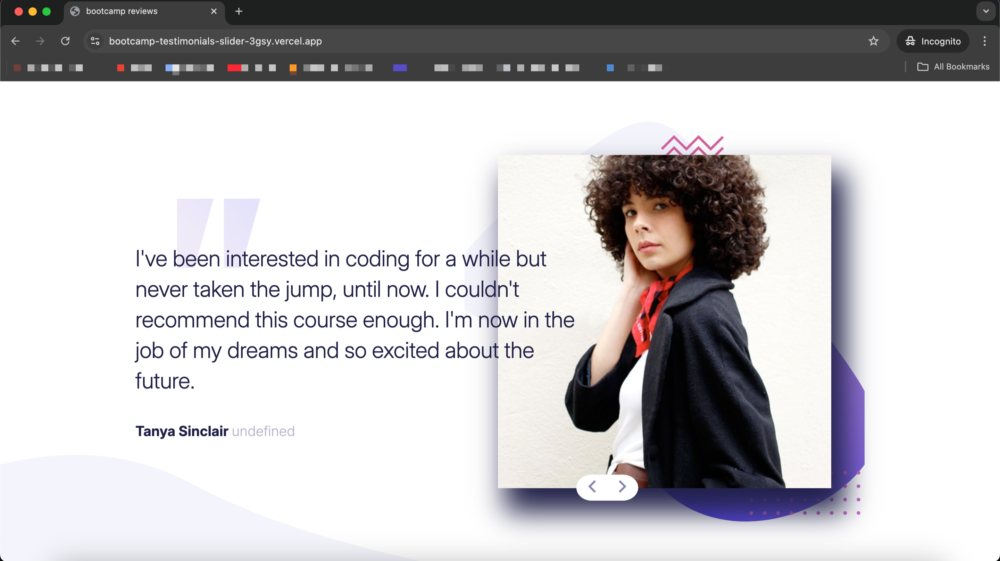

# Frontend Mentor - Coding bootcamp testimonials slider solution

This is a solution to the [Coding bootcamp testimonials slider challenge on Frontend Mentor](https://www.frontendmentor.io/challenges/coding-bootcamp-testimonials-slider-4FNyLA8JL). Frontend Mentor challenges help you improve your coding skills by building realistic projects. 

## Table of contents

- [Overview](#overview)
  - [The challenge](#the-challenge)
  - [Take a look](#take-a-look)
- [Built with](#built-with)
- [Local setup](#local-setup)
- [Author](#author)

## Overview

### The challenge

Users should be able to navigate the slider using either their mouse/trackpad or keyboard.

### Take a look



The user can click the buttons or use the right and left arrows to navigate through testimonials.

- Live Site URL: [Add live site URL here](https://bootcamp-testimonials-slider-3gsy.vercel.app/)

## Built with

- Vite - simple vanilla app
- SASS for styles
- NVM for node version managing
- ESLINT for coding styles

## Local Setup

to run it locally, you must:

- clone the repo:

  ```bash
    git clone git@github.com:ImMPrada/bootcamp-testimonials-slider.git
  ```

- use the right version of node, this project has a .nvmrc so you can run:

  ```bash
    nvm use
  ```

  if your nvm doesn't have the used version, you can run:

  ```bash
    nvm install
  ```

- install dependencies:

  ```bash
    npm install --save-dev
  ```

- run it:

  ```bash
    npm run dev
  ```

## Author

- LinkedIn - [Miguel Prada]([https://www.your-site.com](https://www.linkedin.com/in/immprada/))
- Frontend Mentor - [@ImMPrada](https://www.frontendmentor.io/profile/ImMPrada)
